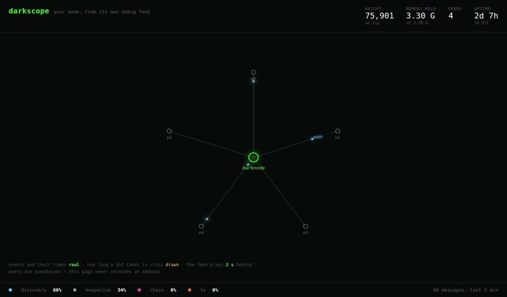

# darkscope

**Watch your own DarkFi node.** What it is talking to, what it is saying, and what it costs
the machine it runs on — drawn from the node's own debug feed, on the machine itself.

```bash
git clone https://github.com/reymom/darkscope && cd darkscope && ./install.sh
# then open http://localhost:8080
```

That is the whole thing. No account, no dashboard service, no npm, no build step. A shell
script, two Python files that import nothing you do not already have, and one HTML page.



---

## Why this exists

A node on a Raspberry Pi told me things I could not have read anywhere: that its memory was
tracking whatever ceiling I gave it, that a €6.64 server dies in the same four hundred blocks
every time, and that one transaction of mine announced which machine it came from. None of
that was visible until I could see the node.

**The failure modes that only appear on small hardware have very few people looking at them**,
because the people building these systems have machines with room. Every operator who can see
their own node is another pair of eyes. This is the seeing part, and it is why it installs in
one command on a board that costs less than a phone.

## What you get

**The panel** — your node in the middle, the peers it is talking to around it, and every
message as it happens. Height, memory against its limit, peer count, uptime. What share of
the traffic is peer discovery rather than anything interesting (it is most of it).

**The collector** — writes to disk on your machine, once a minute for the machine state and
continuously for the P2P feed. It is the history the panel reads, and it is yours: plain
JSONL, one file a day, gzipped after a day, expired after `HISTORY_MAX_DAYS`.

## Three honest things about the picture

1. **The events and their times are real**, to the millisecond, straight from `darkfid`'s
   own `dnet` feed. Nothing is simulated and nothing is inferred.
2. **How long a dot takes to cross the screen is not.** That comes from how long the line is.
   It is animation, and it is the only thing on the page that is.
3. **The feed plays two seconds behind.** Events arrive in batches, and playing them the
   moment they land gives you clumps instead of motion.

## It never handles a peer address

Addresses are mapped to `p1`, `p2`, … inside the server, before anything is serialised. The
browser cannot learn who your peers are, and neither can anyone you show the page to. The map
lives in `panel-ids.json` next to your logs so the names survive a restart.

That is not decoration. **A panel like this is a deanonymization surface** and getting it
wrong is easy — see the open issue about it, which is about this repository and not about
anyone else's code.

## Layout

```
collector/    what runs next to the node
  dnet-record.sh       subscribes to darkfid's dnet feed → dnet-YYYY-MM-DD.jsonl
  darknode-export.sh   one machine snapshot a minute → snapshots-YYYY-MM-DD.jsonl
  darkfid-blocks.sh    one line per applied block: height, calls, gas, contracts
  darknode-digest.py   daily rollup
  node-pulse.py        OPTIONAL — pushes a summary to a site you run
  darkfid-memguard.*   OPTIONAL — a watchdog for when you are still finding your limits
panel/        what you look at
  serve.py      stdlib HTTP server: reads the files above, serves pseudonyms
  index.html
  app.js        canvas, no dependencies
install.sh
```

## Running it

**Locally, which is the default.** Nothing leaves the machine.

```bash
./install.sh
```

**Publishing to a site you run**, which is what the author does, and which adds the only
component that sends anything anywhere:

```bash
./install.sh --publish
# then set NODE_INGEST_TOKEN and INGEST_URL in /etc/darknode-export.env
```

**Without installing anything**, pointed at logs you already have:

```bash
DNET_DIR=/var/log/darknode PORT=8080 ./panel/serve.py
```

## Configuration

Everything is environment variables, in `/etc/darknode-export.env` for the collector and
`/etc/darkscope.env` for the panel.

| | |
|---|---|
| `DARKFID_UNIT` | the systemd unit your node runs as, so memory can be read from its cgroup |
| `DARKFID_MGMT_RPC_PORT` | where `dnet` is, default `18346` |
| `HISTORY_DIR` | where everything is written, default `/var/log/darknode` |
| `HISTORY_MAX_DAYS` | how long to keep it |
| `PORT`, `NODE_NAME` | the panel |
| `INGEST_URL`, `NODE_INGEST_TOKEN` | only if you are publishing |

## Requirements

A Linux machine running `darkfid` under systemd, with `curl`, `jq` and `python3`. It was
built on a Raspberry Pi 5 and a 4 GB x86 VPS, and it assumes nothing else.

## Licence

See [LICENSE](LICENSE). Use it, change it, and if you find something on your own hardware
that nobody has written down, say so somewhere.
